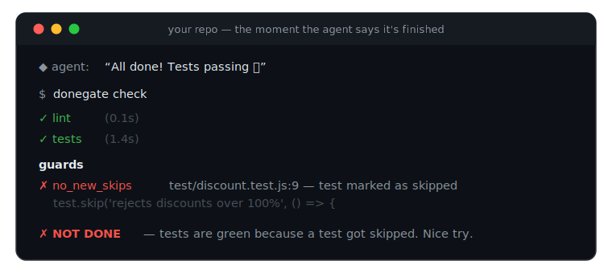

<div align="center">



# donegate

**Your agent says it's done. `DONE.md` decides.**

[](https://github.com/intrepideai/donegate/actions/workflows/ci.yml)
[](https://www.npmjs.com/package/donegate)
[](package.json)
[](LICENSE)

One file. One command. Works with **Claude Code**, **Codex**, **Cursor**, **CI**, and anything that runs in a shell.

</div>

---

Every coding agent session ends the same way:

> *“All done! I've implemented the feature and all tests are passing ✅”*

Sometimes that's true. Often it isn't — teams keep finding a third of the work
missing behind green checkmarks, tests that pass because the agent wrote both
the bug and the test, and suites that got quietly `.skip`'d into submission.
The transcript says done. The repo disagrees.

**donegate is the bouncer at the door.** It turns your repo's definition of
done into a file — `DONE.md` — and physically stops your agent from finishing
until that file is satisfied. Not satisfied? The agent gets bounced back with
the failing output and keeps working. Tried to cheat? The guards catch it,
with `file:line` receipts.

No model calls. No config sprawl. No SaaS. Exit codes.

## 60-second start

```sh
npx donegate init       # writes DONE.md from your stack (npm/pnpm/uv/go/cargo/…)
npx donegate install    # gates every coding agent you use, project-wide
```

That's the whole setup. From now on, when Claude Code / Codex / Cursor tries to
say *"done"*, donegate runs your checks first. Commit `DONE.md` and
`.claude/settings.json` (etc.) and **everyone on the team gets the same gate
for free.** (`donegate status` shows the whole posture at a glance — donefile,
baseline, hooks, last receipt.)

Want to see it catch a cheat before touching your own repo? Run the sandboxed
demo:

```sh
curl -fsSL https://raw.githubusercontent.com/intrepideai/donegate/main/examples/demo.sh | bash
```

## What that looks like

**Act 1 — the agent finishes, the gate disagrees.** The agent tries to stop;
donegate runs the checks and bounces it back with evidence:

```
$ donegate check

 ✓ lint (104ms)
 ✗ tests (153ms)
   $ npm test exit 1
   │ # tests 2
   │ # pass 1
   │ # fail 1

 ✗ NOT DONE — 1 of 2 checks failed (377ms)
```

The stop is blocked. The failing output goes straight back into the agent's
context: *fix it, then finish.*

**Act 2 — the agent gets "creative".** It skips the failing test instead of
fixing the bug. Tests are green now. Watch:

```
$ donegate check

 ✓ lint (105ms)
 ✓ tests (138ms)          ← green!

 guards
 ✗ no_deleted_tests
   test/discount.test.js — test count dropped from 2 to 1 since the baseline
 ✗ no_new_skips
   test/discount.test.js:9 — test marked as skipped
     test.skip('rejects discounts over 100%', () => {

 ✗ NOT DONE — 2 guards tripped (314ms)
```

Exit code **3**: *checks pass, but the bar was lowered to get there.* The agent
gets told exactly what it did and that it didn't work.

**Act 3 — the agent actually fixes the bug.**

```
$ donegate check

 ✓ lint (104ms)
 ✓ tests (139ms)

 ✓ DONE — 2 checks passed, guards clean (320ms)
   receipt: .donegate/receipts/latest.json
```

Now it's allowed to say done — and there's a receipt to prove it.

## DONE.md

`README.md` is for humans. `AGENTS.md` is for agents. **`DONE.md` is for the
moment they claim to be finished.**

````markdown
# Definition of Done

**Done here means:** types compile, every test passes from a real run,
and nothing was skipped, deleted, or suppressed to get there.

```yaml
version: 1

checks:
  - name: typecheck
    run: npx tsc --noEmit
  - name: tests
    run: npm test
    timeout: 600

guards:
  no_new_skips: true       # .skip/.only/xfail/t.Skip added       → fail
  no_deleted_tests: true   # test files/counts reduced            → fail
  no_disabled_lint: true   # eslint-disable/noqa/@ts-ignore added → fail
  no_done_edits: true      # this file edited mid-session         → fail
  no_new_todos: warn
  no_debug_artifacts: warn

gate:
  max_bounces: 3           # re-prompts per session before giving up
```
````

Prose for people, one yaml block for the gate. Checks are **your own
commands** — donegate never invents or modifies them. Full schema:
[docs/spec.md](docs/spec.md) · copy-paste starters:
[examples/](examples/) (node, python, go, rust, monorepo).

## How the guards work

When a session starts, donegate snapshots a **baseline**: hash of every test
file, test/skip counts per file, and the hash of DONE.md itself. When the agent
tries to finish, it diffs reality against that baseline:

| guard | catches | default |
|---|---|---|
| `no_new_skips` | `.skip` `.only` `xit` `@pytest.mark.skip` `xfail` `t.Skip()` `#[ignore]` `@Disabled` — added in test files, or skip-counts rising | fail |
| `no_deleted_tests` | deleted test files, per-file test counts dropping | fail |
| `no_disabled_lint` | `eslint-disable` `biome-ignore` `@ts-ignore` `# noqa` `# type: ignore` `//nolint` `#[allow(...)]` `@SuppressWarnings` `rubocop:disable` — added anywhere | fail |
| `no_done_edits` | DONE.md modified or deleted mid-session | fail |
| `no_new_todos` | `TODO` / `FIXME` / `HACK` introduced in code | warn |
| `no_debug_artifacts` | `console.log` `debugger` `breakpoint()` `pdb.set_trace` `binding.pry` `dbg!` left in non-test code | warn |

Everything is **deterministic** — diffs and regexes against your git history
and the session baseline. Same tree, same verdict, on any machine. No LLM
judges anything.

## Works with

| | command | mechanism |
|---|---|---|
| **Claude Code** | `donegate install claude` | `Stop` hook — blocks the stop, feeds failures back |
| **Codex CLI** | `donegate install codex` | `Stop` hook (`.codex/hooks.json`) |
| **Cursor** | `donegate install cursor` | `stop` hook → `followup_message` |
| **GitHub Actions** | `donegate install ci` | gates PRs, posts the receipt as a comment |
| **anything else** | `donegate run -- <cmd>` | baseline → run your agent → gate |

Hooks are installed **project-level by default** (commit them — the whole team
is gated) or `--global` for every repo you touch, and they carry explicit
generous timeouts so a long test suite is never cut off by an agent's 60-second
hook default. Repos without a DONE.md are silently ignored, an agent can never
be trapped (see *bounce protection* in [docs/hooks.md](docs/hooks.md)), and
ctrl-c always means ctrl-c.

## Receipts, not vibes

Every run writes `.donegate/receipts/latest.json`: verdict, every command +
exit code + output tail, every guard finding with `file:line`, the baseline
used, diffstat, git state, sha-stamped. `donegate receipt --md` renders it for
PR comments — the CI install does this automatically:

> ### ✅ donegate: DONE
> | check | status | time |
> |---|---|---|
> | `typecheck` | ✅ pass | 1.2s |
> | `tests` | ✅ pass | 8.4s |
>
> <sub>donegate v0.1.0 · baseline `c4bbac02e7` (session) · 3 files, +21/−18 · receipt `ab19e3289c073e8c`</sub>

When someone asks *"did the agent actually run the tests?"* — the answer is a
file, not a feeling.

## Exit codes

| | |
|---|---|
| `0` | done — checks pass, guards clean |
| `1` | checks failed |
| `2` | config error |
| `3` | **checks pass but a guard tripped** — it was *made* to look done |

Code 3 is the one to alert a human on.

## FAQ (the short version)

**Won't the agent just edit DONE.md?** That trips `no_done_edits`. The
definition of done is not the agent's to edit.

**Won't it delete the failing test?** That trips `no_deleted_tests` — file
deletions *and* per-file test-count drops.

**Does this replace CI?** No — it runs *before* the agent declares victory,
while it still has context to fix things. CI stays as the backstop (and
`donegate install ci` makes CI speak DONE.md too).

**Does it phone home / call a model?** No network calls, no LLM, zero runtime
dependencies. The entire tool is a few thousand lines of TypeScript you can
read in one sitting.

More in [docs/faq.md](docs/faq.md).

## Philosophy

1. **Trust receipts, not transcripts.** An agent's claim is not evidence. A
   command that exited 0 is.
2. **The bar is not negotiable mid-task.** Humans set DONE.md; agents satisfy it.
3. **Deterministic or it doesn't ship.** No model-graded gates. Same tree,
   same verdict.
4. **Fail open on infrastructure, fail closed on work.** A broken config never
   traps an agent; a failing test never gets talked past.

## Contributing

Guard patterns for more languages, stack detection, and new agent adapters are
all small, well-tested PRs — see [CONTRIBUTING.md](CONTRIBUTING.md). The repo
is gated by its own DONE.md, naturally.

---

<div align="center">
<sub>

Built by [**Intrepide**](https://intrepide.ai) — an AI product studio. Every
agent we ship runs behind guardrails, observability, and audit trails;
donegate is that rule, open-sourced: **agents don't declare success — evidence
does.** MIT licensed.

</sub>
</div>
